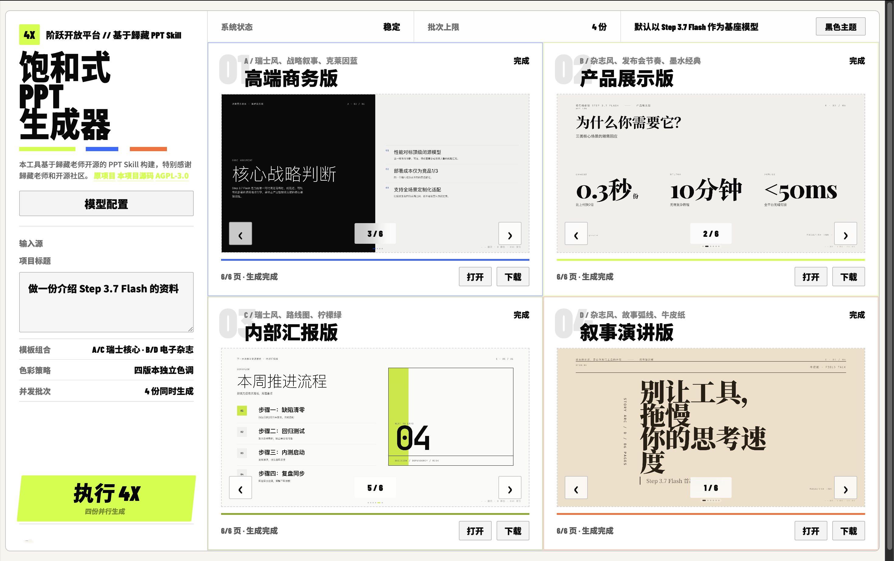
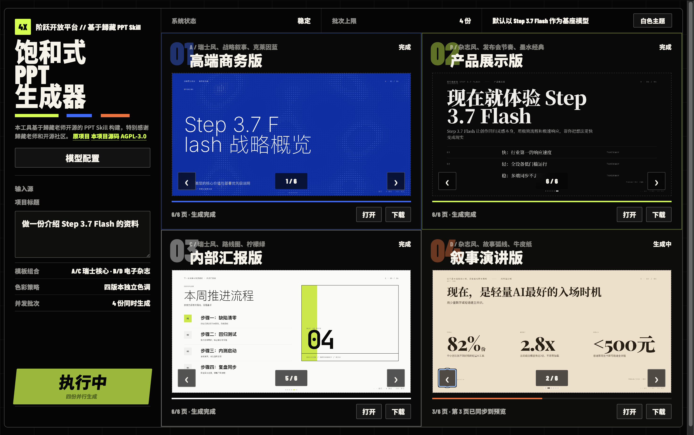

# Four-up PPT Generator / 饱和式 PPT 生成器

语言：简体中文 | [English](README.en.md)

一个面向中文演示场景的四宫格 HTML PPT 生成器。输入一个主题后，系统会并行生成 A/B/C/D 四份不同内容视角、不同视觉风格的网页 PPT，并在生成过程中逐页同步预览。

在线体验：

- https://4ppt.vercel.app/

## 界面预览

<table>
  <tr>
    <td width="50%">
      
    </td>
    <td width="50%">
      
    </td>
  </tr>
  <tr>
    <td align="center">Light theme</td>
    <td align="center">Dark theme</td>
  </tr>
</table>

源码仓库：

- https://github.com/woniuniuniu/four-up-ppt-generator

## 致谢与来源

本项目基于 [op7418/guizang-ppt-skill](https://github.com/op7418/guizang-ppt-skill) 构建。这个原项目由 op7418 / 歸藏老师开源，提供了面向 AI Agent 的 HTML PPT 生成 Skill、演示模板、视觉主题、版式规则和设计参考，是本项目最重要的基础。

如果你对这个项目感兴趣，请优先阅读、使用和支持原项目：

- 原项目：<https://github.com/op7418/guizang-ppt-skill>
- 作者：op7418 / 歸藏
- 原项目许可证：AGPL-3.0

本仓库保留了原项目链接、许可证说明和原项目当前主分支快照 `vendor/guizang-ppt-skill/`，用于明确来源、便于追溯，并向原作者的开源工作表示感谢。本项目不是原项目的官方版本，如有署名、说明或合规处理不妥之处，欢迎指出，我会优先修正。

## 功能

- 四路并行生成：A/B/C/D 四份 PPT 独立请求模型，避免“一套内容换四个皮肤”。
- 逐页实时预览：模型输出到哪一页，页面就同步展示到哪一页。
- 差异化叙事：商务汇报、产品展示、内部 briefing、叙事演讲四种方向。
- HTML PPT：保留 PPT 内部脚本、动画、WebGL 和交互能力。
- 双主题界面：支持深色 / 浅色主题切换。
- 双模式密钥策略：托管演示版可使用服务端环境变量；开源/自部署版可由用户在页面填写自己的模型配置。

## 模型配置

默认目标模型是 Step 3.7 Flash，并按 OpenAI-compatible `chat/completions` 风格调用。项目主要围绕阶跃星辰接口做适配；其他兼容接口理论上可以尝试，但不作为强保证。

两种使用方式：

- 托管演示版：部署者可以在 Vercel 环境变量中配置 API Key，让访问者打开网页即可体验。
- 开源/自部署版：仓库不包含任何真实 API Key；如果没有服务端密钥，页面会要求使用者填写模型名称、Base URL 和 API Key。

用户在页面里填写的 API Key 只随单次生成请求转发，不写入文件、数据库或仓库。请不要把 `.env`、`.vercel`、账号密码或任何真实 API Key 提交到公开仓库。

## 开发与自部署

环境要求：

- Node.js 18+
- 一个兼容的模型 API Key

安装依赖：

```bash
npm install
```

启动开发服务：

```bash
npm run dev
```

默认访问地址：

```text
http://localhost:5177/
```

可选环境变量：

| 变量 | 说明 |
| --- | --- |
| `STEPFUN_PROVIDER` | 服务商名称，默认 `StepFun` |
| `STEPFUN_MODEL` | 模型名称，默认 `step-3.7-flash` |
| `STEPFUN_BASE_URL` | 模型服务地址，默认 `https://api.stepfun.com/v1` |
| `STEPFUN_API_KEY` | 托管演示版使用的服务端 API Key；不要提交到仓库 |
| `STEPFUN_REASONING_EFFORT` | 推理强度，默认 `medium` |
| `PORT` | 本地端口，默认 `5177` |

部署到 Vercel 时，可以只配置非密钥默认项；如果要提供“打开即用”的托管演示版，再在 Vercel 项目环境变量中配置 `STEPFUN_API_KEY`。

## 项目结构

```text
api/                         Vercel serverless API
lib/                         生成、渲染、模型请求和流式同步逻辑
public/                      前端页面、样式和预览交互
vendor/guizang-ppt-skill/        原项目当前主分支快照
NOTICE.md                    来源与致谢说明
LICENSE                      AGPL-3.0 许可证
```

## 开源协议

本项目以 AGPL-3.0-only 开源。由于本项目基于 AGPL-3.0 的原项目构建，任何公开部署或再分发都应保留原作者署名、原项目链接、许可证说明，并提供对应源码。

本项目按现状提供，不提供任何明示或暗示担保。使用者需要自行承担模型调用成本、部署安全和 API Key 管理责任。
